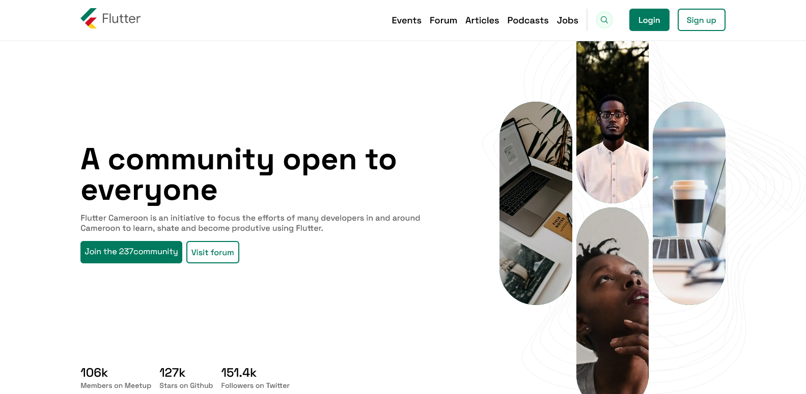

# Flutter Cameroon Website


```bash
npm install
# or
yarn install
```
Run the server:
```bash
npm run dev
# or
yarn dev
```

From your browser open [http://localhost:3000](http://localhost:3000) to see the result.

## More
- To preview, click
[live preview](https://flutter-website-octopse.vercel.app/)
- Design by Johan. I made some adjustments
- View **Desktop Design** click [here](https://github.com/octopse/flutter-website-cmr/raw/main/public/images/DesignDesktop.jpg) 
- View **Mobile Design** click [here](https://github.com/octopse/flutter-website-cmr/raw/main/public/images/DesignMobile.jpg)
or [there](https://github.com/octopse/flutter-website-cmr/blob/main/public/images/DesignMobile.jpg)
